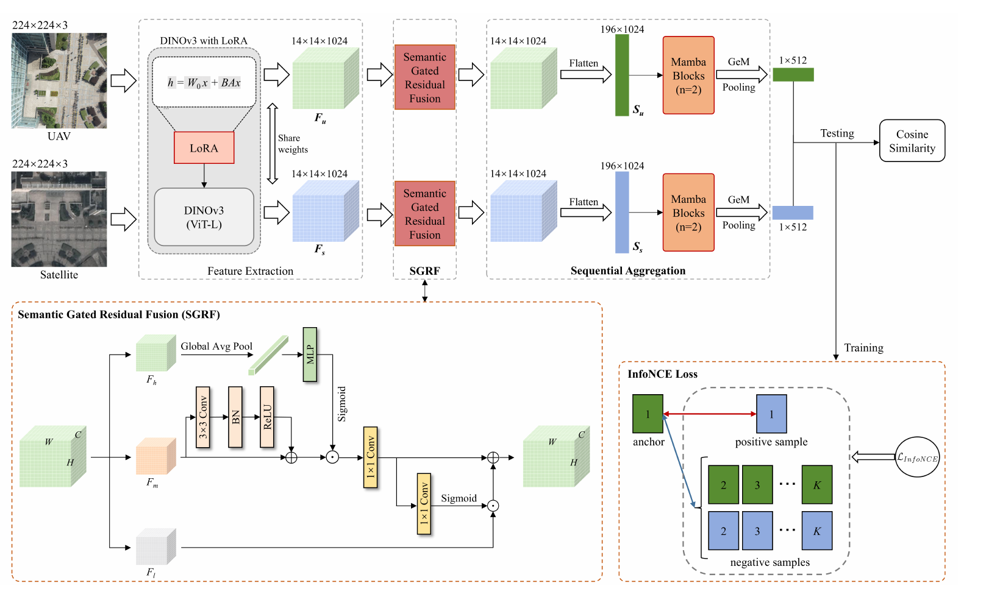

<div align="center">

# DINO-GFSA

### Geo-Localization via Semantic Gated Fusion and Mamba-based Sequential Aggregation

[](https://arxiv.org/abs/2606.00784)


Official implementation of our **IEEE ICME 2026 Oral** paper.

</div>

## Overview

**DINO-GFSA** is a cross-view geo-localization framework that matches UAV
images with geo-referenced satellite imagery. It combines three key designs:

- **DINOv3 with LoRA** provides strong visual representations while updating
  only a small set of trainable parameters.
- **Semantic Gated Residual Fusion (SGRF)** uses high-level semantics to
  calibrate mid-level features and selectively inject useful low-level spatial
  details from layers 16, 20, and 24.
- **Mamba-based Sequential Aggregation (SA)** models long-range spatial
  dependencies with linear complexity before GeM pooling produces the final
  512-dimensional descriptor.

The model is trained end-to-end with InfoNCE loss and uses cosine similarity
for cross-view image retrieval.

## Framework

<p align="center">
  
</p>

## Main Results

| Dataset / Task | R@1 | R@5 | AP | SDM@1 |
|---|---:|---:|---:|---:|
| University-1652, UAV → Satellite | **95.68** | - | **96.34** | - |
| University-1652, Satellite → UAV | **96.29** | - | **95.56** | - |
| DenseUAV | **97.17** | **99.57** | - | **97.68** |

## Model Weights

| Model | Backbone | Download | Access code |
|---|---|---|---|
| DINO-GFSA | DINOv3 ViT-L | [Baidu Netdisk](https://pan.baidu.com/s/1KcpqnOnfkkWyPpEESjoobQ?pwd=z4dn) | `z4dn` |

## Citation

If you find this work useful, please cite our paper:

```bibtex
@misc{hu2026dinogfsa,
  title={DINO-GFSA: Geo-Localization via Semantic Gated Fusion and Mamba-based Sequential Aggregation},
  author={Hu, Beier and Guo, Yuanshen and Cai, Jialu and Li, Chengwei and Wang, Yong and Wu, Shunan and Wu, Zhigang},
  year={2026},
  eprint={2606.00784},
  archivePrefix={arXiv},
  primaryClass={cs.CV},
  doi={10.48550/arXiv.2606.00784},
  url={https://arxiv.org/abs/2606.00784}
}
```
